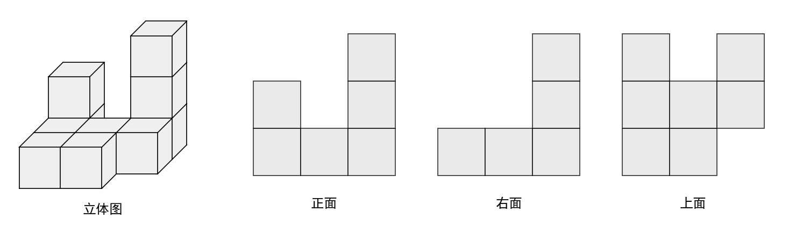
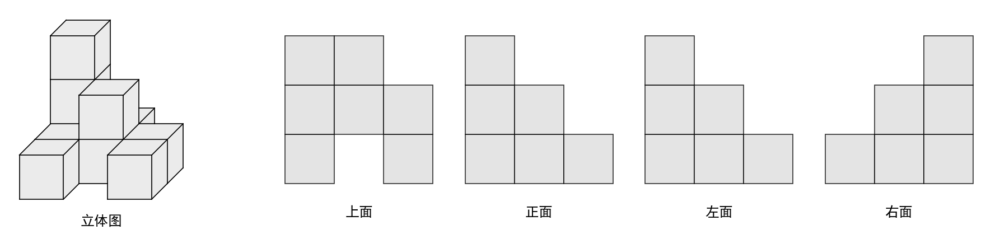

## Project Name: cube-stack-oblique
### 1. Overview
Python scripts for drawing an oblique projection of stacked cubes.
### 2. Environment & Dependencies
#### Supported Python Version
- Recommended: Python 3.8 ~ 3.11
- Minimum requirement: Python 3.7+
#### Install Required Dependencies
- matplotlib
- numpy
- shapely
### 3. Quick Start

#### Img generate
```python
from matrix2xy45 import CubeStacking
cubes = CubeStacking([[2, 0, 3], [1, 1, 1], [1, 1, 0]])
# Views Image
cubes.c2D()
# Solid Shape
cubes.c3D()
# Solid Shape + Views Image
cubes.c23D('frt')
cubes.c23D(view_str,save_path)
```


